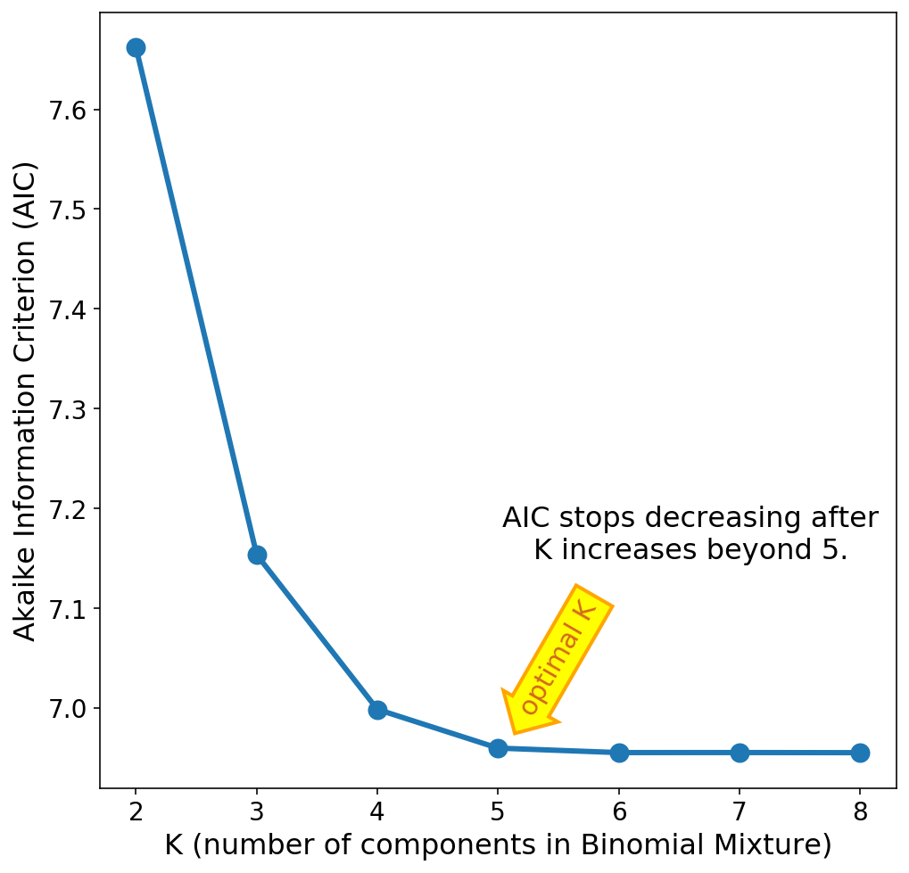

# Binomial Mixture Model with Expectation-Maximization Algorithm

[This article](https://medium.com/@jingluan.xw/binomial-mixture-model-with-expectation-maximum-em-algorithm-feeaf0598b60) provides a high-level explanation of the formulas used in this model. Please refer to [my note](https://www.dropbox.com/s/fy2kq9eanhwinpr/Binomial_Mixture_Model_EL_Algorithm_Derivations%20%281%29.pdf?dl=0) if you are interested in the detailed derivations of the equations of the Expectation-Maximization (EM) Algorithm adopted.

* If you are interested in how I develop the model step by step following [the article](https://medium.com/@jingluan.xw/binomial-mixture-model-with-expectation-maximum-em-algorithm-feeaf0598b60), please refer to the notebook `step_by_step_development.ipynb`.

  This notebook also deals with the choice for K, the number of components in a BMM. Say, K=3, meaning that there are three different binomial distributions in the mixture model. The optimal `K` is chosen based on Akaike Information Criterion (AIC) and Bayesian Information Criterion (BIC). The AIC and BIC decreases as `K` increases, and they flatten (or stops decreasing dramatically) with increasing `K` at the some value. Then this value is chosen as the optimal `K`.

* The python script `BinomialMixture.py` wraps the functions defined in the previous notebook `BMM_EM_Algorithm_fit_K_torch.ipynb` into a Class called `BinomialMixture`. This `BinomialMixture` object has several methods. The `.fit()` method takes in pairs of (N,n) and train a BinomialMixture model. The `.predict()`
method takes in a new (or old) set of (N,n) pairs and predicts the posterior probabilities for them to belong to each component of the already-trained Binomial-Mixture model.

* The jupyter notebook `tutorial.ipynb` calls the object `BinomialMixture` from `BinomialMixture.py`
and uses its `.fit()` method to fit some artificially generated data by a number of Binomial Mixture Models of different values of `K`, and uses AIC to pick the optimal value of `K`.

* The jupyter notebook `p_value_diagnosis.ipynb` shows the example of fitting BMM on DNA data. The data used in this file is not publically available, so you won't be able to reproduce the results in this notebook. The purpose of putting this notebook here is to show you that a BMM model may better describe the sequencing noise in the DNA data and thus makes the histogram of p values sensible. The value of `K` is chosen based on the the figure below which shows that the optimal `K` is the value beyond which the AIC stops decreasing significantly.

  

## Dependencies

* pytorch, which is good at matrix manipulations and allows the use of gpu.
* commonly used packages: numpy, scipy, matplotlib
* I develop this package in Python 3.7

# Author
Jing Luan -- jingluan.xw at gmail dot com

# Citing this code
Please cite this repository, when using this code.

# Licensing

Copyright 2019 by Jing Luan.

In brief, you can use, distribute, and change this package as you please.

THE SOFTWARE IS PROVIDED "AS IS", WITHOUT WARRANTY OF ANY KIND, EXPRESS OR IMPLIED, INCLUDING BUT NOT LIMITED TO THE WARRANTIES OF MERCHANTABILITY, FITNESS FOR A PARTICULAR PURPOSE AND NONINFRINGEMENT. IN NO EVENT SHALL THE AUTHORS OR COPYRIGHT HOLDERS BE LIABLE FOR ANY CLAIM, DAMAGES OR OTHER LIABILITY, WHETHER IN AN ACTION OF CONTRACT, TORT OR OTHERWISE, ARISING FROM, OUT OF OR IN CONNECTION WITH THE SOFTWARE OR THE USE OR OTHER DEALINGS IN THE SOFTWARE.

# Acknowledgement

Jing Luan is supported by Association of Members of the Institute for Advanced Study (Amias) while developing this project.
